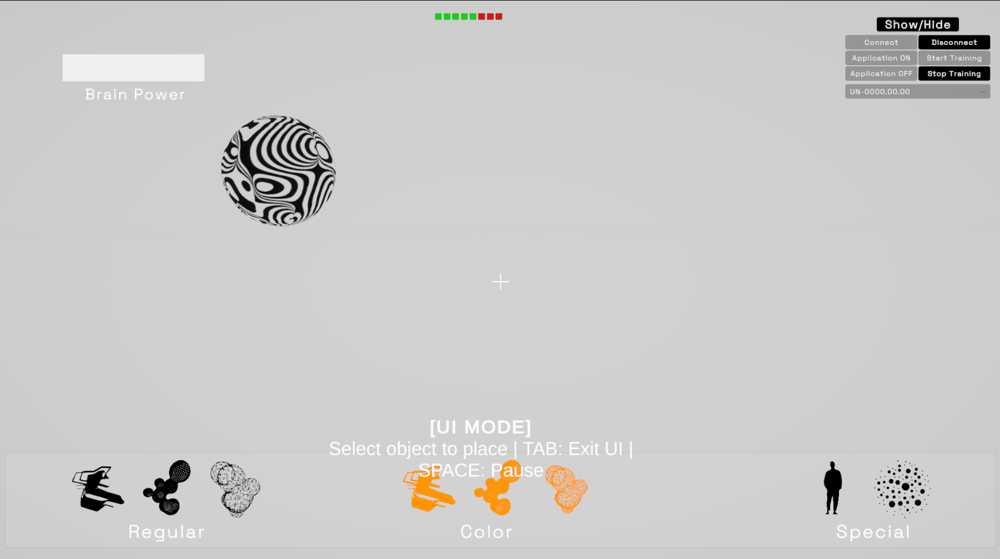

# 🧠 BrainSculptor

**BrainSculptor** is an experimental Unity application that allows users to sculpt 3D geometry using **Brain–Computer Interface (BCI)** commands.  
It integrates the **Unicorn EEG SDK** to translate neural signals into creative control gestures inside a virtual 3D environment.

Developed in **Unity 6 (6000.x)** during the **Global Summer School 2025 – IAAC Dubai Node**:  
👉 [https://globalschool.iaac.net/gss25_dubai/](https://globalschool.iaac.net/gss25_dubai/)

---

## 🖼️ Preview

  
*Main view of the application. The floating globe acts as flashing target to elicit ERP response. The Brain Power bar fills with sustained focus on the target, providing a modulation to the selected transformation*

---

## ⚙️ Features

- Real-time EEG input via the **Unicorn SDK**
- Neural command mapping for sculpting and shape manipulation
- Parametric mesh deformation controlled by user focus or intention
- OSC streaming of the Brain Power values to interact with other compatible applications
- Modular Unity 6 setup for *future* BCI–VR or BCI–AR extensions 
- Designed for experimental and educational use during GSS 2025

---

## 🧩 Requirements

- **Unity 6 (6000.x or later)**  
- **Unicorn SDK** (installed and configured)  
- **Unicorn Hybrid Black** EEG device  
- **WindowsS** platform  

---

## 🚀 Installation & Setup

1. **Clone or download** this repository:
   ```bash
   git clone https://github.com/BRomans/BrainSculptor.git
   ```

2. **Open the project** in **Unity 6**.

3. **Import the Unicorn EEG SDK**:
   - Download the SDK from the official [g.tec Unicorn website](https://www.unicorn-bi.com/)
   - In Unity, go to `Assets → Import Package → Custom Package`
   - Select the `UnicornSDK.unitypackage` file and import all dependencies

4. **Connect your EEG device**:
   - Power on your Unicorn Hybrid Black (or compatible hardware)
   - Verify connection using the **Unicorn Suite**
   - Ensure data streaming is enabled before starting the Unity scene

5. **Run the scene**:
   - Open the main scene (`Scenes/BrainSculptor.unity`)
   - Press **Play** and start sculpting using your EEG signals!

---

## 🧠 Usage

1. [Download](https://github.com/BRomans/GSS_BrainSculptor/releases) or build the application
2. Double click on the .exe file
3. Press TAB to enter UI mode
4. Connect the device by selecting the serial ID from the dropdown
5. Calibrate the device by focusing on the flashing target
6. If calibration is successful (Green/Yellow score) proceed, otherwise repeat point 5.
7. Enter/Exit UI mode with TAB button. Select shapes and place them with mouse. Use your focus on the flashing target to modulate the transformation and press ESC to freeze.
8. Enjoy

---

## 🧑‍💻 Authors

Developed during the **Global Summer School 2025 – IAAC Dubai Node**

**Team BrainSculptor**  
- [Michele Romani](https://bromans.github.io) – Unity Development / BCI Integration  
- [Krzysztof Galant](https://krzgalant.wixsite.com/my-site) – Unity Development / VFX & 3D modeling  

Mentored by **IAAC Faculty** and **GSS25 Dubai Node Coordinators**.

---

## 📄 License

This project is released under the **MIT License**.  
See [LICENSE](LICENSE) for more details.

---

## 🙌 Acknowledgments

Special thanks to:
- **IAAC Global Summer School 2025**
- **g.tec medical engineering GmbH** for the Unicorn SDK

